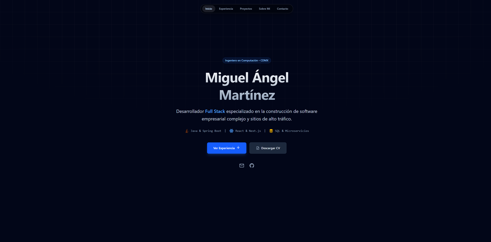

# 🚀 Portafolio de Miguel Ángel Martínez - Full Stack 

> Portafolio personal moderno y de alto rendimiento construido con una arquitectura basada en islas y optimización extrema.

 

## 📋 Descripción

Este proyecto no es solo una tarjeta de presentación; es una demostración técnica de ingeniería web moderna. El objetivo principal fue lograr una puntuación de **100/100 en Core Web Vitals** sin sacrificar una estética premium con animaciones complejas.

El sitio implementa patrones de diseño como **Glassmorphism**, efectos de iluminación dinámica (**Spotlight**) y transiciones de estado suaves, todo mantenido bajo una arquitectura de componentes estricta.

## 🛠️ Tech Stack

* **Core:** [Astro 5](https://astro.build/) - Para renderizado estático y arquitectura de islas (Zero JS by default).
* **Estilos:** [Tailwind CSS](https://tailwindcss.com/) - Para un sistema de diseño utilitario y responsivo.
* **Iconografía:** [Astro Icon](https://www.astroicon.dev/) (Iconify) - Carga optimizada de SVGs.
* **Tipografía:** Google Fonts (Onest Variable) - Optimizada para carga rápida.
* **Interactividad:** Vanilla TypeScript & IntersectionObserver API - Para animaciones performantes sin librerías pesadas.

## ✨ Características Técnicas

* **⚡ Performance First:** Puntuación perfecta en Lighthouse. Carga de recursos crítica optimizada.
* **🎨 UI Avanzada:**
    * Efecto **Spotlight** (luz seguidora del mouse) calculado en tiempo real con CSS Variables.
    * **Glassmorphism** (efecto cristal) con `backdrop-filter` y capas de ruido.
    * **Bento Grid Layout** para la presentación de información.
* **📱 Responsive Design:** Adaptación fluida desde móviles hasta pantallas 4K.
* **🔍 SEO Friendly:** Metadatos Open Graph y JSON-LD configurados para máxima visibilidad.

## 🚀 Instalación y Uso Local

Si deseas clonar y correr este proyecto localmente:

1.  **Clonar el repositorio:**
    ```bash
    git clone [https://github.com/miguel0exe/porfolio.git](https://github.com/miguel0exe/porfolio.git)
    cd porfolio
    ```

2.  **Instalar dependencias:**
    ```bash
    npm install
    ```

3.  **Correr servidor de desarrollo:**
    ```bash
    npm run dev
    ```

4.  **Generar build de producción:**
    ```bash
    npm run build
    ```

## 📂 Estructura del Proyecto

```text
src/
├── components/      # Componentes UI (Hero, Bento Grid, Navbar)
├── layouts/         # Layout principal (SEO, Fuentes, Estilos globales)
├── pages/           # Rutas y páginas (Astro file-based routing)
└── styles/          # Estilos globales adicionales


